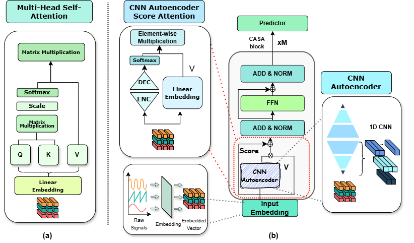
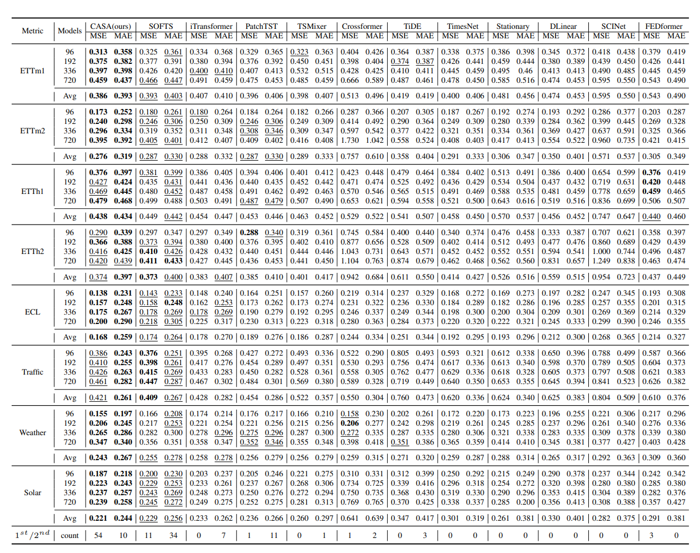

# CASA

The repo is the official implementation for the paper: "CASA: CNN Autoencoder-based Score Attention for Efficient Multivariate Long-term Time-series Forecasting" (IJCAI 2025)


## Overall Architecture

CASA regards **CNN Autoencoder-based Score Attenton** improving channel-wise tokenization and shows **Model Agnostic Feature** including **Computational Efficiency**.

<p align="center">

</p>

The main result of CASA is as the following:

<p align="center">

</p>

## Usage 

1. Install Pytorch and necessary dependencies.

```
pip install -r requirements.txt
```

2. Train and evaluate the model. We provide all the above tasks under the folder ./scripts/. You can reproduce the results as the following examples:

```
# ECL dataset :  Multivariate forecasting with CASA 
bash ./scripts/long_term_forecast/ECL_script/CASA.sh
```

## Citation

If you find this repo helpful, please cite our paper. 

```
@misc{lee2025casacnnautoencoderbasedscore,
      title={CASA: CNN Autoencoder-based Score Attention for Efficient Multivariate Long-term Time-series Forecasting}, 
      author={Minhyuk Lee and HyeKyung Yoon and MyungJoo Kang},
      year={2025},
      eprint={2505.02011},
      archivePrefix={arXiv},
      primaryClass={cs.LG},
      url={https://arxiv.org/abs/2505.02011}, 
}
```

